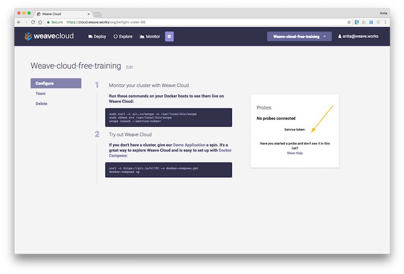
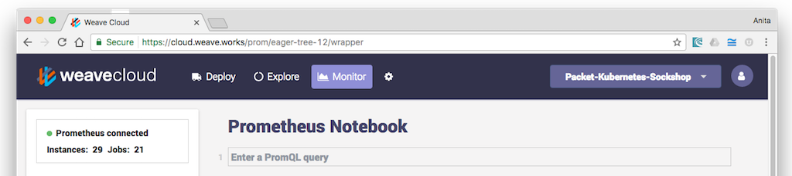

# Open source, horizontally scalable Prometheus as a service

*NB this is a pre-beta service. Availability is not 100%. APIs might change. Data could be lost.*

Cortex is an API compatible [Prometheus](https://prometheus.io) implementation, that natively supports multitenancy and horizontal scale-out clustering.

Cortex is a [Weaveworks](https://weave.works) project that forms the monitoring backend of [Weave Cloud](https://cloud.weave.works).

## Getting Started with Weave Cloud & Kubernetes

Go to https://cloud.weave.works and sign up. Follow the steps to create a new instance.

Once you have created your instance, note down the 'Service Token' listed underneath 'Probes' in the box on the right of the screen. You will use this token to authenticate your local Prometheus with Weave Cloud.

Install the Cortex agent (an unmodified OSS Prometheus) on your Kubernetes cluster using the following command:

    $ kubectl -n kube-system apply -f 'https://cloud.weave.works/k8s/cortex.yaml?t=<token>'

Click Monitor to access the Cortex service in the Weave Cloud UI:

Weave Cloud gives you some example queries that displays general system information.  You can of course [write your own Prometheus queries](https://prometheus.io/docs/querying/basics/).

## About Weave Cortex

To learn more about Weave Cortex, consult the follow documents / talks:

- [Original design document for Project Frankenstein](http://goo.gl/prdUYV)
- PromCon 2016 Talk: "Project Frankenstein: Multitenant, Scale-Out Prometheus": [video](https://youtu.be/3Tb4Wc0kfCM), [slides](http://www.slideshare.net/weaveworks/project-frankenstein-a-multitenant-horizontally-scalable-prometheus-as-a-service)
- KubeCon Prometheus Day talk "Weave Cortex: Multi-tenant, horizontally scalable Prometheus as a Service" [slides](http://www.slideshare.net/weaveworks/weave-cortex-multitenant-horizontally-scalable-prometheus-as-a-service)
- Or join us on [our Slack channel](https://slack.weave.works) and ask us directly!

## Using Cortex on Other Platforms

Cortex can be used to monitor virtually any application on any platform, as the local agent is a specially configured unmodified OSS Prometheus binary.  You can [download Prometheus from its website](https://prometheus.io/download/).  You will need v1.2.1 or later.

When you've got Prometheus, you will need to [configure it to discover your services](https://prometheus.io/docs/operating/configuration/) and configure it to send its data to Weave Cloud by adding the following top-level stanza to `prometheus.yml`:

    remote_write:
      url: https://cloud.weave.works/api/prom/push
      basic_auth:
        password: <token>

Where `<token>` is the Service Token you obtained from Weave Cloud.

Once your local Prometheus is running you can enter Prometheus queries into
Weave Cloud. Go to https://cloud.weave.works and click Monitor from Weave Cloud header:

## Using Cortex to power Grafana dashboards

To use the Prometheus Service with Grafana, configure your Grafana instance to have a datasource with the following parameters:

- Type: Prometheus
- Url: https://cloud.weave.works/api/prom
- Access: Direct
- Http Auth: Basic Auth
- User: `user` (this is ignored, but must be non-empty)
- Password: <Service Token> (the same one your retrieval agent uses)

## Developing

To build & test, install minikube, and run:

    eval $(minikube docker-env)
    make
    kubectl create -f ./k8s

Cortex will sit behind an nginx instance exposed on port 30080.  A job is deployed to scrape it itself.  Try it:

http://192.168.99.100:30080/api/prom/api/v1/query?query=up

### Vendoring

We use `dep` to vendor dependencies.  We use a custom branch with support for
pruneing the vendor tree, from github.com/tomwilkie/dep.

To fetch a new dependency, run:

    dep ensure && dep prune

To update dependencies, run

    dep ensure --update && dep prine

## Getting Help

If you have any questions regarding Cortex our hosted Prometheus as a service:

- Invite yourself to the <a href="https://weaveworks.github.io/community-slack/" target="_blank"> #weave-community </a> slack channel.
- Ask a question on the <a href="https://weave-community.slack.com/messages/general/"> #weave-community</a> slack channel.
- Join the <a href="https://www.meetup.com/pro/Weave/"> Weave User Group </a> and get invited to online talks, hands-on training and meetups in your area.
- Send an email to <a href="mailto:weave-users@weave.works">weave-users@weave.works</a>
- <a href="https://github.com/weaveworks/cortex/issues/new">File an issue.</a>

Your feedback is always welcomeu
