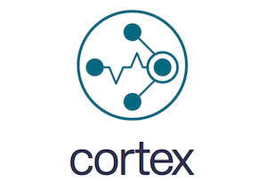

# Cortex: horizontally scalable, highly available, multi-tenant, long term storage for Prometheus.

Cortex provides horizontally scalable, highly available, multi-tenant, long term storage for
[Prometheus](https://prometheus.io).

- **Horizontally scalable:** Cortex can run across multiple machines in a cluster, exceeding the throughput and storage of a single machine. This enables you to send the metrics from multiple Prometheus servers to a single Cortex cluster and run "globally aggregated" queries across all data in a single place.
- **Highly available:** When run in a cluster, Cortex can replicate data between machines. This allows you to survive machine failure without gaps in your graphs.
- **Multi-tenant:** Cortex can isolate data and queries from multiple different independent
Prometheus sources in a single cluster, allowing untrusted parties to share the same cluster.
- **Long term storage:** Cortex supports S3, GCS, Swift and Microsoft Azure for long term storage of metric data. This allows you to durably store data for longer than the lifetime of any single machine, and use this data for long term capacity planning.

Cortex is a [CNCF](https://cncf.io) incubation project used in several production systems including [Weave Cloud](https://cloud.weave.works) and [Grafana Cloud](https://grafana.com/cloud).
Cortex is primarily used as a [remote write](https://prometheus.io/docs/operating/configuration/#remote_write) destination for Prometheus, with a Prometheus-compatible query API.

## Chunk Storage Deprecation Notice

The chunks storage is deprecated since v1.10.0. You're encouraged to use the [blocks storage](docs/blocks-storage/_index.md).

Chunks storage is scheduled to be removed in release 1.14.0

## Documentation

Read the [getting started guide](https://cortexmetrics.io/docs/getting-started) if you're new to the
project. Before deploying Cortex with a permanent storage backend you
should read:
1. [An overview of Cortex's architecture](https://cortexmetrics.io/docs/architecture/)
1. [Getting started with Cortex](https://cortexmetrics.io/docs/getting-started/)
1. [Information regarding configuring Cortex](https://cortexmetrics.io/docs/configuration/)

For a guide to contributing to Cortex, see the [contributor guidelines](https://cortexmetrics.io/docs/contributing/).

## Further reading

To learn more about Cortex, consult the following talks and articles.

### Recent talks and articles

- Dec 2020 blog post "[How AWS and Grafana Labs are scaling Cortex for the cloud](https://aws.amazon.com/blogs/opensource/how-aws-and-grafana-labs-are-scaling-cortex-for-the-cloud/)"
- Oct 2020 blog post "[How to switch Cortex from chunks to blocks storage (and why you won’t look back)](https://grafana.com/blog/2020/10/19/how-to-switch-cortex-from-chunks-to-blocks-storage-and-why-you-wont-look-back/)"
- Oct 2020 blog post "[Now GA: Cortex blocks storage for running Prometheus at scale with reduced operational complexity](https://grafana.com/blog/2020/10/06/now-ga-cortex-blocks-storage-for-running-prometheus-at-scale-with-reduced-operational-complexity/)"
- Sep 2020 blog post "[A Tale of Tail Latencies](https://www.weave.works/blog/a-tale-of-tail-latencies)"
- Sep 2020 KubeCon talk "Scaling Prometheus: How We Got Some Thanos Into Cortex" ([video](https://www.youtube.com/watch?v=Z5OJzRogAS4), [slides](https://static.sched.com/hosted_files/kccnceu20/ec/2020-08%20-%20KubeCon%20EU%20-%20Cortex%20blocks%20storage.pdf))
- Aug 2020 blog post "[Scaling Prometheus: How we’re pushing Cortex blocks storage to its limit and beyond](https://grafana.com/blog/2020/08/12/scaling-prometheus-how-were-pushing-cortex-blocks-storage-to-its-limit-and-beyond/)"
- Jul 2020 blog post "[How blocks storage in Cortex reduces operational complexity for running Prometheus at massive scale](https://grafana.com/blog/2020/07/29/how-blocks-storage-in-cortex-reduces-operational-complexity-for-running-prometheus-at-massive-scale/)"
- Jul 2020 PromCon talk "Sharing is Caring: Leveraging Open Source to Improve Cortex & Thanos" ([video](https://www.youtube.com/watch?v=2oTLouUvsac), [slides](https://docs.google.com/presentation/d/1OuKYD7-k9Grb7unppYycdmVGWN0Bo0UwdJRySOoPdpg/edit))
- Mar 2020 blog post "[Cortex: Zone Aware Replication](https://kenhaines.net/cortex-zone-aware-replication/)"
- Mar 2020 blog post "[How we're using gossip to improve Cortex and Loki availability](https://grafana.com/blog/2020/03/25/how-were-using-gossip-to-improve-cortex-and-loki-availability/)"
- Jan 2020 blog post "[The Future of Cortex: Into the Next Decade][future-of-cortex-blog]"

[future-of-cortex-blog]: https://grafana.com/blog/2020/01/21/the-future-of-cortex-into-the-next-decade/

### Previous talks and articles

- Nov 2019 KubeCon talks "[Cortex 101: Horizontally Scalable Long Term Storage for Prometheus][kubecon-cortex-101]" ([video][kubecon-cortex-101-video], [slides][kubecon-cortex-101-slides]), "[Configuring Cortex for Max
Performance][kubecon-cortex-201]" ([video][kubecon-cortex-201-video], [slides][kubecon-cortex-201-slides], [write up][kubecon-cortex-201-writeup]) and "[Blazin’ Fast PromQL][kubecon-blazin]" ([slides][kubecon-blazin-slides], [video][kubecon-blazin-video], [write up][kubecon-blazin-writeup])
- Nov 2019 PromCon talk "[Two Households, Both Alike in Dignity: Cortex and Thanos][promcon-two-households]" ([video][promcon-two-households-video], [slides][promcon-two-households-slides], [write up][promcon-two-households-writeup])
- May 2019 KubeCon talks; "[Cortex: Intro][kubecon-cortex-intro]" ([video][kubecon-cortex-intro-video], [slides][kubecon-cortex-intro-slides], [blog post][kubecon-cortex-intro-blog]) and "[Cortex: Deep Dive][kubecon-cortex-deepdive]" ([video][kubecon-cortex-deepdive-video], [slides][kubecon-cortex-deepdive-slides])
- Feb 2019 blog post & podcast; "[Prometheus Scalability with Bryan Boreham][prometheus-scalability]" ([podcast][prometheus-scalability-podcast])
- Feb 2019 blog post; "[How Aspen Mesh Runs Cortex in Production][aspen-mesh-2019]"
- Dec 2018 KubeCon talk; "[Cortex: Infinitely Scalable Prometheus][kubecon-2018-talk]" ([video][kubecon-2018-video], [slides][kubecon-2018-slides])
- Dec 2018 CNCF blog post; "[Cortex: a multi-tenant, horizontally scalable Prometheus-as-a-Service][cncf-2018-blog]"
- Nov 2018 CloudNative London meetup talk; "Cortex: Horizontally Scalable, Highly Available Prometheus" ([slides][cloudnative-london-2018-slides])
- Nov 2018 CNCF TOC Presentation; "Horizontally Scalable, Multi-tenant Prometheus" ([slides][cncf-toc-presentation])
- Sept 2018 blog post; "[What is Cortex?][what-is-cortex]"
- Aug 2018 PromCon panel; "[Prometheus Long-Term Storage Approaches][promcon-2018-panel]" ([video][promcon-2018-video])
- Jul 2018 design doc; "[Cortex Query Optimisations][cortex-query-optimisation-2018]"
- Aug 2017 PromCon talk; "[Cortex: Prometheus as a Service, One Year On][promcon-2017-talk]" ([videos][promcon-2017-video], [slides][promcon-2017-slides], write up [part 1][promcon-2017-writeup-1], [part 2][promcon-2017-writeup-2], [part 3][promcon-2017-writeup-3])
- Jun 2017 Prometheus London meetup talk; "Cortex: open-source, horizontally-scalable, distributed Prometheus" ([video][prometheus-london-2017-video])
- Dec 2016 KubeCon talk; "Weave Cortex: Multi-tenant, horizontally scalable Prometheus as a Service" ([video][kubecon-2016-video], [slides][kubecon-2016-slides])
- Aug 2016 PromCon talk; "Project Frankenstein: Multitenant, Scale-Out Prometheus": ([video][promcon-2016-video], [slides][promcon-2016-slides])
- Jun 2016 design document; "[Project Frankenstein: A Multi Tenant, Scale Out Prometheus](http://goo.gl/prdUYV)"

[kubecon-cortex-101]: https://kccncna19.sched.com/event/UaiH/cortex-101-horizontally-scalable-long-term-storage-for-prometheus-chris-marchbanks-splunk
[kubecon-cortex-101-video]: https://www.youtube.com/watch?v=f8GmbH0U_kI
[kubecon-cortex-101-slides]: https://static.sched.com/hosted_files/kccncna19/92/cortex_101.pdf
[kubecon-cortex-201]: https://kccncna19.sched.com/event/UagC/performance-tuning-and-day-2-operations-goutham-veeramachaneni-grafana-labs
[kubecon-cortex-201-slides]: https://static.sched.com/hosted_files/kccncna19/87/Taming%20Cortex_%20Configuring%20for%20maximum%20performance%281%29.pdf
[kubecon-cortex-201-video]: https://www.youtube.com/watch?v=VuE5aDHDexU
[kubecon-cortex-201-writeup]: https://grafana.com/blog/2019/12/02/kubecon-recap-configuring-cortex-for-maximum-performance-at-scale/
[kubecon-blazin]: https://kccncna19.sched.com/event/UaWT/blazin-fast-promql-tom-wilkie-grafana-labs
[kubecon-blazin-slides]: https://static.sched.com/hosted_files/kccncna19/0b/2019-11%20Blazin%27%20Fast%20PromQL.pdf
[kubecon-blazin-video]: https://www.youtube.com/watch?v=yYgdZyeBOck
[kubecon-blazin-writeup]: https://grafana.com/blog/2019/09/19/how-to-get-blazin-fast-promql/
[promcon-two-households]: https://promcon.io/2019-munich/talks/two-households-both-alike-in-dignity-cortex-and-thanos/
[promcon-two-households-video]: https://www.youtube.com/watch?v=KmJnmd3K3Ws&feature=youtu.be
[promcon-two-households-slides]: https://promcon.io/2019-munich/slides/two-households-both-alike-in-dignity-cortex-and-thanos.pdf
[promcon-two-households-writeup]: https://grafana.com/blog/2019/11/21/promcon-recap-two-households-both-alike-in-dignity-cortex-and-thanos/
[kubecon-cortex-intro]: https://kccnceu19.sched.com/event/MPhX/intro-cortex-tom-wilkie-grafana-labs-bryan-boreham-weaveworks
[kubecon-cortex-intro-video]: https://www.youtube.com/watch?v=_7Wnta-3-W0
[kubecon-cortex-intro-slides]: https://static.sched.com/hosted_files/kccnceu19/af/Cortex%20Intro%20KubeCon%20EU%202019.pdf
[kubecon-cortex-intro-blog]: https://grafana.com/blog/2019/05/21/grafana-labs-at-kubecon-the-latest-on-cortex/
[kubecon-cortex-deepdive]: https://kccnceu19.sched.com/event/MPjK/deep-dive-cortex-tom-wilkie-grafana-labs-bryan-boreham-weaveworks
[kubecon-cortex-deepdive-video]: https://www.youtube.com/watch?v=mYyFT4ChHio
[kubecon-cortex-deepdive-slides]: https://static.sched.com/hosted_files/kccnceu19/52/Cortex%20Deep%20Dive%20KubeCon%20EU%202019.pdf
[prometheus-scalability]: https://www.weave.works/blog/prometheus-scalability-with-bryan-boreham
[prometheus-scalability-podcast]: https://softwareengineeringdaily.com/2019/01/21/prometheus-scalability-with-bryan-boreham/
[aspen-mesh-2019]: https://www.weave.works/blog/how-aspen-mesh-runs-cortex-in-production
[kubecon-2018-talk]: https://kccna18.sched.com/event/GrXL/cortex-infinitely-scalable-prometheus-bryan-boreham-weaveworks
[kubecon-2018-video]: https://www.youtube.com/watch?v=iyN40FsRQEo
[kubecon-2018-slides]: https://static.sched.com/hosted_files/kccna18/9b/Cortex%20CloudNativeCon%202018.pdf
[cloudnative-london-2018-slides]: https://www.slideshare.net/grafana/cortex-horizontally-scalable-highly-available-prometheus
[cncf-2018-blog]: https://www.cncf.io/blog/2018/12/18/cortex-a-multi-tenant-horizontally-scalable-prometheus-as-a-service/
[cncf-toc-presentation]: https://docs.google.com/presentation/d/190oIFgujktVYxWZLhLYN4q8p9dtQYoe4sxHgn4deBSI/edit#slide=id.g3b8e2d6f7e_0_6
[what-is-cortex]: https://medium.com/weaveworks/what-is-cortex-2c30bcbd247d
[promcon-2018-panel]: https://promcon.io/2018-munich/talks/panel-discussion-prometheus-long-term-storage-approaches/
[promcon-2018-video]: https://www.youtube.com/watch?v=3pTG_N8yGSU
[prometheus-london-2017-video]: https://www.youtube.com/watch?v=Xi4jq2IUbLs
[promcon-2017-talk]: https://promcon.io/2017-munich/talks/cortex-prometheus-as-a-service-one-year-on/
[promcon-2017-video]: https://www.youtube.com/watch?v=_8DmPW4iQBQ
[promcon-2017-slides]: https://promcon.io/2017-munich/slides/cortex-prometheus-as-a-service-one-year-on.pdf
[promcon-2017-writeup-1]: https://kausal.co/blog/cortex-prometheus-aas-promcon-1/
[promcon-2017-writeup-2]: https://kausal.co/blog/cortex-prometheus-aas-promcon-2/
[promcon-2017-writeup-3]: https://kausal.co/blog/cortex-prometheus-aas-promcon-3/
[cortex-query-optimisation-2018]: https://docs.google.com/document/d/1lsvSkv0tiAMPQv-V8vI2LZ8f4i9JuTRsuPI_i-XcAqY
[kubecon-2016-video]: https://www.youtube.com/watch?v=9Uctgnazfwk
[kubecon-2016-slides]: http://www.slideshare.net/weaveworks/weave-cortex-multitenant-horizontally-scalable-prometheus-as-a-service
[promcon-2016-video]: https://youtu.be/3Tb4Wc0kfCM
[promcon-2016-slides]: http://www.slideshare.net/weaveworks/project-frankenstein-a-multitenant-horizontally-scalable-prometheus-as-a-service

## Getting Help

If you have any questions about Cortex:

- Ask a question on the [Cortex Slack channel](https://cloud-native.slack.com/messages/cortex/). To invite yourself to the CNCF Slack, visit http://slack.cncf.io/.
- <a href="https://github.com/cortexproject/cortex/issues/new">File an issue.</a>
- Send an email to <a href="mailto:cortex-users@lists.cncf.io">cortex-users@lists.cncf.io</a>

Your feedback is always welcome.

For security issues see https://github.com/cortexproject/cortex/security/policy

## Community Meetings

The Cortex community call happens every two weeks on Thursday, alternating at 1200 UTC and 1700 UTC. Meeting notes are held [here](https://docs.google.com/document/d/1shtXSAqp3t7fiC-9uZcKkq3mgwsItAJlH6YW6x1joZo/edit).

To see meeting calendar:

- See the calendar [in your browser (time zone will be UTC)](https://calendar.google.com/calendar/u/0/embed?src=cncf-cortex-maintainers@lists.cncf.io&ctz=UTC).
- If you use Google Calendar, [add the Cortex's calendar to your own Google Calendar](https://calendar.google.com/calendar/u/0?cid=Y25jZi1jb3J0ZXgtbWFpbnRhaW5lcnNAbGlzdHMuY25jZi5pbw).
- You can also just [download the .ics file](https://calendar.google.com/calendar/ical/cncf-cortex-maintainers%40lists.cncf.io/public/basic.ics).

## Hosted Cortex (Prometheus as a service)

There are several commercial services where you can use Cortex
on-demand:

### Weave Cloud

[Weave Cloud](https://cloud.weave.works) from
[Weaveworks](https://weave.works) lets you deploy, manage, and monitor
container-based applications. Sign up at https://cloud.weave.works
and follow the instructions there. Additional help can also be found
in the [Weave Cloud documentation](https://www.weave.works/docs/cloud/latest/overview/).

[Instrumenting Your App: Best Practices](https://www.weave.works/docs/cloud/latest/tasks/monitor/best-instrumenting/)

### Amazon Managed Service for Prometheus (AMP)

[Amazon Managed Service for Prometheus (AMP)](https://aws.amazon.com/prometheus/) is a Prometheus-compatible monitoring service that makes it easy to monitor containerized applications at scale. It is a highly available, secure, and managed monitoring for your containers. Get started [here](https://console.aws.amazon.com/prometheus/home). To learn more about the AMP, reference our [documentation](https://docs.aws.amazon.com/prometheus/latest/userguide/what-is-Amazon-Managed-Service-Prometheus.html) and [Getting Started with AMP blog](https://aws.amazon.com/blogs/mt/getting-started-amazon-managed-service-for-prometheus/).

## Emeritus Maintainers

* Peter Štibraný @pstibrany
* Marco Pracucci @pracucci
* Bryan Boreham @bboreham
* Goutham Veeramachaneni @gouthamve
* Jacob Lisi @jtlisi
* Tom Wilkie @tomwilkie

## History of Cortex
The Cortex project was started by Tom Wilkie (Grafana Labs' VP Product) and Julius Volz (Prometheus' co-founder) in June 2016.
