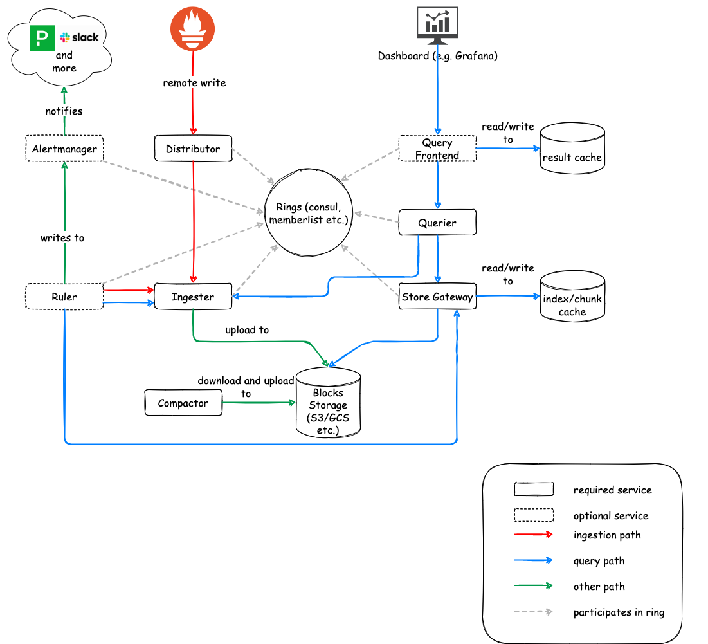

Cortex consists of multiple horizontally scalable microservices. Each microservice uses the most appropriate technique for horizontal scaling; most are stateless and can handle requests for any users while some (namely the [ingesters](#ingester)) are semi-stateful and depend on consistent hashing. This document provides a basic overview of Cortex's architecture.

## The role of Prometheus

Prometheus instances scrape samples from various targets and then push them to Cortex (using Prometheus' [remote write API](https://prometheus.io/docs/prometheus/latest/storage/#remote-storage-integrations)). That remote write API emits batched [Snappy](https://google.github.io/snappy/)-compressed [Protocol Buffer](https://developers.google.com/protocol-buffers/) messages inside the body of an HTTP `PUT` request.

Cortex requires that each HTTP request bear a header specifying a tenant ID for the request. Request authentication and authorization are handled by an external reverse proxy.

Incoming samples (writes from Prometheus) are handled by the [distributor](#distributor) while incoming reads (PromQL queries) are handled by the [querier](#querier) or optionally by the [query frontend](#query-frontend).

## Storage

Cortex currently supports the `blocks` storage engine to store and query time series. It used to support `chunks` storage in the past.

### Blocks storage

The blocks storage is based on [Prometheus TSDB](https://prometheus.io/docs/prometheus/latest/storage/): it stores each tenant's time series into their own TSDB which write out their series to a on-disk Block (defaults to 2h block range periods). Each Block is composed by a few files storing the chunks and the block index.

The TSDB chunk files contain the samples for multiple series. The series inside the Chunks are then indexed by a per-block index, which indexes metric names and labels to time series in the chunk files.

The blocks storage doesn't require a dedicated storage backend for the index. The only requirement is an object store for the Block files, which can be:

* [Amazon S3](https://aws.amazon.com/s3)
* [Google Cloud Storage](https://cloud.google.com/storage/)
* [Microsoft Azure Storage](https://azure.microsoft.com/en-us/services/storage/)
* [OpenStack Swift](https://wiki.openstack.org/wiki/Swift) (experimental)
* [Local Filesystem](https://thanos.io/storage.md/#filesystem) (single node only)

For more information, please check out the [Blocks storage](./blocks-storage/_index.md) documentation.

## Services

Cortex has a service-based architecture, in which the overall system is split up into a variety of components that perform a specific task. These components run separately and in parallel. Cortex can alternatively run in a single process mode, where all components are executed within a single process. The single process mode is particularly handy for local testing and development.

Cortex is, for the most part, a shared-nothing system. Each layer of the system can run multiple instances of each component and they don't coordinate or communicate with each other within that layer.

The Cortex services are:

- [Distributor](#distributor)
- [Ingester](#ingester)
- [Querier](#querier)
- [Compactor](./blocks-storage/compactor.md) (required for blocks storage)
- [Store gateway](./blocks-storage/store-gateway.md) (required for blocks storage)
- [Alertmanager](#alertmanager) (optional)
- [Configs API](#configs-api) (optional)
- [Overrides exporter](./guides/overrides-exporter.md) (optional)
- [Query frontend](#query-frontend) (optional)
- [Query scheduler](./operations/scalable-query-frontend.md#query-scheduler) (optional)
- [Ruler](#ruler) (optional)

### Distributor

The **distributor** service is responsible for handling incoming samples from Prometheus. It's the first stop in the write path for series samples. Once the distributor receives samples from Prometheus, each sample is validated for correctness and to ensure that it is within the configured tenant limits, falling back to default ones in case limits have not been overridden for the specific tenant. Valid samples are then split into batches and sent to multiple [ingesters](#ingester) in parallel.

The validation done by the distributor includes:

- The metric labels name are formally correct
- The configured max number of labels per metric is respected
- The configured max length of a label name and value is respected
- The timestamp is not older/newer than the configured min/max time range

Distributors are **stateless** and can be scaled up and down as needed.

#### High Availability Tracker

The distributor features a **High Availability (HA) Tracker**. When enabled, the distributor deduplicates incoming samples from redundant Prometheus servers. This allows you to have multiple HA replicas of the same Prometheus servers, writing the same series to Cortex and then deduplicate these series in the Cortex distributor.

The HA Tracker deduplicates incoming samples based on a cluster and replica label. The cluster label uniquely identifies the cluster of redundant Prometheus servers for a given tenant, while the replica label uniquely identifies the replica within the Prometheus cluster. Incoming samples are considered duplicated (and thus dropped) if received by any replica which is not the current primary within a cluster.

The HA Tracker requires a key-value (KV) store to coordinate which replica is currently elected. The distributor will only accept samples from the current leader. Samples with one or no labels (of the replica and cluster) are accepted by default and never deduplicated.

The supported KV stores for the HA tracker are:

* [Consul](https://www.consul.io)
* [Etcd](https://etcd.io)

Note: Memberlist is not supported. Memberlist-based KV store propagates updates using gossip, which is very slow for HA purposes: result is that different distributors may see different Prometheus server as elected HA replica, which is definitely not desirable.

For more information, please refer to [config for sending HA pairs data to Cortex](guides/ha-pair-handling.md) in the documentation.

#### Hashing

Distributors use consistent hashing, in conjunction with a configurable replication factor, to determine which ingester instance(s) should receive a given series.

Cortex supports two hashing strategies:

1. Hash the metric name and tenant ID (default)
2. Hash the metric name, labels and tenant ID (enabled with `-distributor.shard-by-all-labels=true`)

The trade-off associated with the latter is that writes are more balanced across ingesters but each query needs to talk to all ingesters since a metric could be spread across multiple ingesters given different label sets.

#### The hash ring

A hash ring (stored in a key-value store) is used to achieve consistent hashing for the series sharding and replication across the ingesters. All [ingesters](#ingester) register themselves into the hash ring with a set of tokens they own; each token is a random unsigned 32-bit number. Each incoming series is [hashed](#hashing) in the distributor and then pushed to the ingester owning the tokens range for the series hash number plus N-1 subsequent ingesters in the ring, where N is the replication factor.

To do the hash lookup, distributors find the smallest appropriate token whose value is larger than the [hash of the series](#hashing). When the replication factor is larger than 1, the next subsequent tokens (clockwise in the ring) that belong to different ingesters will also be included in the result.

The effect of this hash set up is that each token that an ingester owns is responsible for a range of hashes. If there are three tokens with values 0, 25, and 50, then a hash of 3 would be given to the ingester that owns the token 25; the ingester owning token 25 is responsible for the hash range of 1-25.

The supported KV stores for the hash ring are:

* [Consul](https://www.consul.io)
* [Etcd](https://etcd.io)
* Gossip [memberlist](https://github.com/hashicorp/memberlist)

#### Quorum consistency

Since all distributors share access to the same hash ring, write requests can be sent to any distributor and you can setup a stateless load balancer in front of it.

To ensure consistent query results, Cortex uses [Dynamo-style](https://www.allthingsdistributed.com/files/amazon-dynamo-sosp2007.pdf) quorum consistency on reads and writes. This means that the distributor will wait for a positive response of at least one half plus one of the ingesters to send the sample to before successfully responding to the Prometheus write request.

#### Load balancing across distributors

We recommend randomly load balancing write requests across distributor instances. For example, if you're running Cortex in a Kubernetes cluster, you could run the distributors as a Kubernetes [Service](https://kubernetes.io/docs/concepts/services-networking/service/).

### Ingester

The **ingester** service is responsible for writing incoming series to a [long-term storage backend](#storage) on the write path and returning in-memory series samples for queries on the read path.

Incoming series are not immediately written to the storage but kept in memory and periodically flushed to the storage (by default, 2 hours). For this reason, the [queriers](#querier) may need to fetch samples both from ingesters and long-term storage while executing a query on the read path.

Ingesters contain a **lifecycler** which manages the lifecycle of an ingester and stores the **ingester state** in the [hash ring](#the-hash-ring). Each ingester could be in one of the following states:

- **`PENDING`** 
  The ingester has just started. While in this state, the ingester doesn't receive neither write and read requests.
- **`JOINING`** 
  The ingester is starting up and joining the ring. While in this state the ingester doesn't receive neither write and read requests. The ingester will join the ring using tokens loaded from disk (if `-ingester.tokens-file-path` is configured) or generate a set of new random ones. Finally, the ingester optionally observes the ring for tokens conflicts and then, once any conflict is resolved, will move to `ACTIVE` state.
- **`ACTIVE`** 
  The ingester is up and running. While in this state the ingester can receive both write and read requests.
- **`LEAVING`** 
  The ingester is shutting down and leaving the ring. While in this state the ingester doesn't receive write requests, while it could receive read requests.
- **`UNHEALTHY`** 
  The ingester has failed to heartbeat to the ring's KV Store. While in this state, distributors skip the ingester while building the replication set for incoming series and the ingester does not receive write or read requests.

Ingesters are **semi-stateful**.

#### Ingesters failure and data loss

If an ingester process crashes or exits abruptly, all the in-memory series that have not yet been flushed to the long-term storage will be lost. There are two main ways to mitigate this failure mode:

1. Replication
2. Write-ahead log (WAL)

The **replication** is used to hold multiple (typically 3) replicas of each time series in the ingesters. If the Cortex cluster loses an ingester, the in-memory series hold by the lost ingester are also replicated at least to another ingester. In the event of a single ingester failure, no time series samples will be lost while, in the event of multiple ingesters failure, time series may be potentially lost if failure affects all the ingesters holding the replicas of a specific time series.

The **write-ahead log** (WAL) is used to write to a persistent disk all incoming series samples until they're flushed to the long-term storage. In the event of an ingester failure, a subsequent process restart will replay the WAL and recover the in-memory series samples.

Contrary to the sole replication and given the persistent disk data is not lost, in the event of multiple ingesters failure each ingester will recover the in-memory series samples from WAL upon subsequent restart. The replication is still recommended in order to ensure no temporary failures on the read path in the event of a single ingester failure.

#### Ingesters write de-amplification

Ingesters store recently received samples in-memory in order to perform write de-amplification. If the ingesters would immediately write received samples to the long-term storage, the system would be very difficult to scale due to the very high pressure on the storage. For this reason, the ingesters batch and compress samples in-memory and periodically flush them out to the storage.

Write de-amplification is the main source of Cortex's low total cost of ownership (TCO).

### Querier

The **querier** service handles queries using the [PromQL](https://prometheus.io/docs/prometheus/latest/querying/basics/) query language.

Queriers fetch series samples both from the ingesters and long-term storage: the ingesters hold the in-memory series which have not yet been flushed to the long-term storage. Because of the replication factor, it is possible that the querier may receive duplicated samples; to resolve this, for a given time series the querier internally **deduplicates** samples with the same exact timestamp.

Queriers are **stateless** and can be scaled up and down as needed.

### Query frontend

The **query frontend** is an **optional service** providing the querier's API endpoints and can be used to accelerate the read path. When the query frontend is in place, incoming query requests should be directed to the query frontend instead of the queriers. The querier service will be still required within the cluster, in order to execute the actual queries.

The query frontend internally performs some query adjustments and holds queries in an internal queue. In this setup, queriers act as workers which pull jobs from the queue, execute them, and return them to the query-frontend for aggregation. Queriers need to be configured with the query frontend address (via the `-querier.frontend-address` CLI flag) in order to allow them to connect to the query frontends.

Query frontends are **stateless**. However, due to how the internal queue works, it's recommended to run a few query frontend replicas to reap the benefit of fair scheduling. Two replicas should suffice in most cases.

Flow of the query in the system when using query-frontend:

1) Query is received by query frontend, which can optionally split it or serve from the cache.
2) Query frontend stores the query into in-memory queue, where it waits for some querier to pick it up.
3) Querier picks up the query, and executes it.
4) Querier sends result back to query-frontend, which then forwards it to the client.

Query frontend can also be used with any Prometheus-API compatible service. In this mode Cortex can be used as an query accelerator with it's caching and splitting features on other prometheus query engines like Thanos Querier or your own Prometheus server.  Query frontend needs to be configured with downstream url address(via the `-frontend.downstream-url` CLI flag), which is the endpoint of the prometheus server intended to be connected with Cortex.

#### Queueing

The query frontend queuing mechanism is used to:

* Ensure that large queries, that could cause an out-of-memory (OOM) error in the querier, will be retried on failure. This allows administrators to under-provision memory for queries, or optimistically run more small queries in parallel, which helps to reduce the TCO.
* Prevent multiple large requests from being convoyed on a single querier by distributing them across all queriers using a first-in/first-out queue (FIFO).
* Prevent a single tenant from denial-of-service-ing (DOSing) other tenants by fairly scheduling queries between tenants.

#### Splitting

The query frontend splits multi-day queries into multiple single-day queries, executing these queries in parallel on downstream queriers and stitching the results back together again. This prevents large (multi-day) queries from causing out of memory issues in a single querier and helps to execute them faster.

#### Caching

The query frontend supports caching query results and reuses them on subsequent queries. If the cached results are incomplete, the query frontend calculates the required subqueries and executes them in parallel on downstream queriers. The query frontend can optionally align queries with their step parameter to improve the cacheability of the query results. The result cache is compatible with any cortex caching backend (currently memcached, redis, and an in-memory cache).

### Query Scheduler

Query Scheduler is an **optional** service that moves the internal queue from query frontend into separate component.
This enables independent scaling of query frontends and number of queues (query scheduler).

In order to use query scheduler, both query frontend and queriers must be configured with query scheduler address
(using `-frontend.scheduler-address` and `-querier.scheduler-address` options respectively).

Flow of the query in the system changes when using query scheduler:

1) Query is received by query frontend, which can optionally split it or serve from the cache.
2) Query frontend forwards the query to random query scheduler process.
3) Query scheduler stores the query into in-memory queue, where it waits for some querier to pick it up.
3) Querier picks up the query, and executes it.
4) Querier sends result back to query-frontend, which then forwards it to the client.

Query schedulers are **stateless**. It is recommended to run two replicas to make sure queries can still be serviced while one replica is restarting.

### Ruler

The **ruler** is an **optional service** executing PromQL queries for recording rules and alerts. The ruler requires a database storing the recording rules and alerts for each tenant.

Ruler is **semi-stateful** and can be scaled horizontally.
Running rules internally have state, as well as the ring the rulers initiate.
However, if the rulers all fail and restart,
Prometheus alert rules have a feature where an alert is restored and returned to a firing state
if it would have been active in its for period.
However, there would be gaps in the series generated by the recording rules.

### Alertmanager

The **alertmanager** is an **optional service** responsible for accepting alert notifications from the [ruler](#ruler), deduplicating and grouping them, and routing them to the correct notification channel, such as email, PagerDuty or OpsGenie.

The Cortex alertmanager is built on top of the [Prometheus Alertmanager](https://prometheus.io/docs/alerting/alertmanager/), adding multi-tenancy support. Like the [ruler](#ruler), the alertmanager requires a database storing the per-tenant configuration.

Alertmanager is **semi-stateful**.
The Alertmanager persists information about silences and active alerts to its disk.
If all of the alertmanager nodes failed simultaneously there would be a loss of data.

### Configs API

The **configs API** is an **optional service** managing the configuration of Rulers and Alertmanagers.
It provides APIs to get/set/update the ruler and alertmanager configurations and store them into backend.
Current supported backend are PostgreSQL and in-memory.

Configs API is **stateless**.
