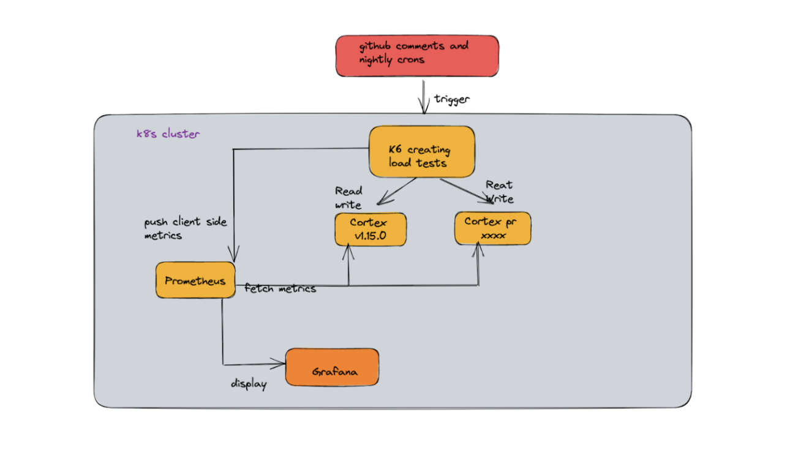

- Author: @kama910
- Date: May 2023
- Status: Accepted

### Overview

In order to monitor the performance regression and improvement of cortex, we want to have a way to continuously monitor the performance of Cortex codebase. This project is to run load tests using k6 against Cortex clusters and display performance metrics.

### Goals

Have a way to understand performance regression or improvements by running macro benchmarks against specific PR or commits.

### Workflow

1. Maintainer commented on a pr to trigger benchmark tests. For comment syntax, we will use something similar to the [example](https://github.com/prometheus/prometheus/pull/11833) in Prombench. There is a Github bot running in K8s cluster to listen for those comments and take actions accordingly. For example, we can utilize `/cortexBench + [target]` to initiate the load tests. Target can be either a version tag or a target branch like `main`, `release-1.15`, etc.

2. Start building custom Cortex images against target branches.

3. Call K8s API to start Cortex clusters. We run Cortex in single process mode. Each test Cortex instance is a separate namespace in K8s.

4. Start K6 jobs. K6 jobs will ingest metrics using remote write API and then execute predefined queries.

5. During the benchmark, Prometheus will collect performance metrics and metrics can be displayed via Grafana in real time.

6. After benchmark finishes, test Cortex clusters will be deleted automatically.

### Reference
1. https://github.com/prometheus/test-infra
2. https://k6.io/docs/
