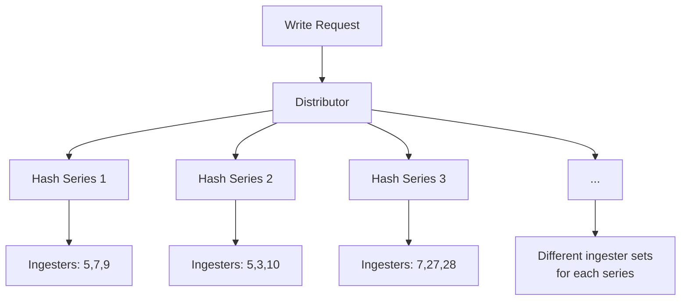
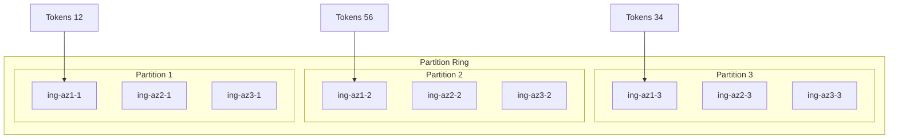
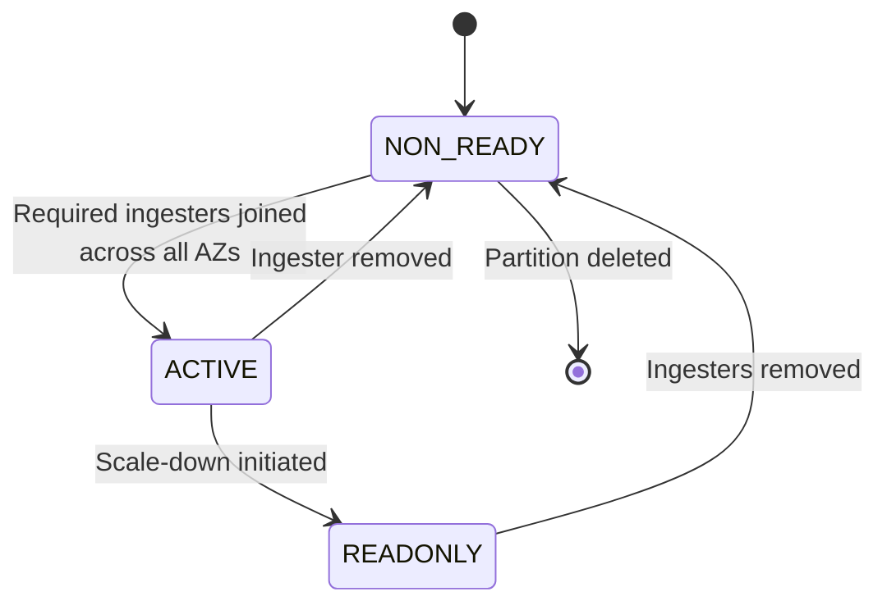
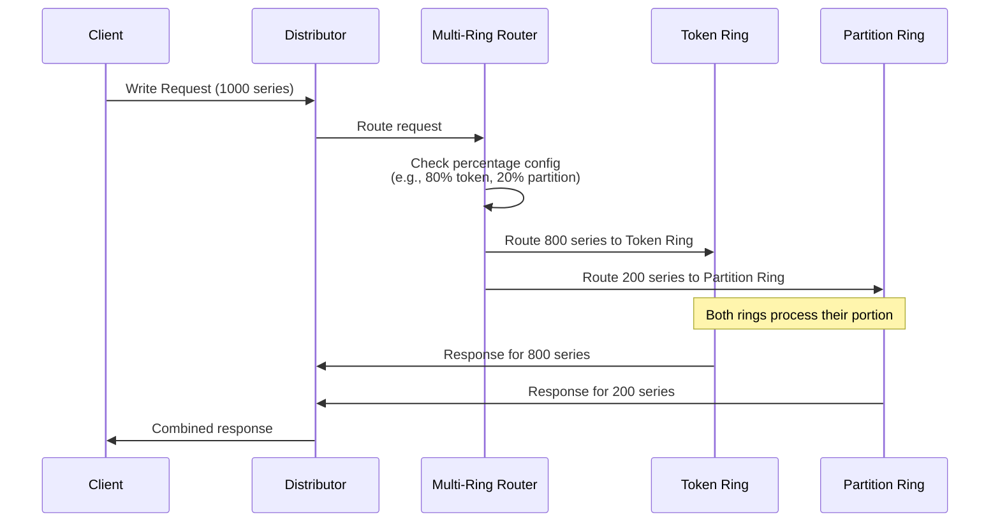

- Author: [Daniel Blando](https://github.com/danielblando)
- Date: July 2025
- Status: Proposed

## Background

Distributors use a token-based ring to shard data across ingesters. Each ingester owns random tokens (32-bit numbers) in a hash ring. For each incoming series, the distributor:

1. Hashes the series labels to get a hash value
2. Finds the primary ingester (smallest token > hash value)
3. When replication is enabled, selects additional replicas by moving clockwise around the ring
4. Ensures replicas are distributed across different availability zones

The issue arises when replication is enabled: each series in a request is hashed independently, causing each series to route to different groups of ingesters.



## Problem

### Limited AZ Failure Tolerance with replication factor

While the token ring effectively distributes load across the ingester fleet, the independent hashing and routing of each series creates an amplification effect where a single ingester failure can impact a large number of write requests.

Consider a ring with 30 ingesters, each series gets distributed to three different ingesters:

```
Sample 1: {name="http_request_latency",api="/push", status="2xx"}
         → Ingesters: ing-5, ing-7, ing-9
Sample 2: {name="http_request_latency",api="/push", status="4xx"}
         → Ingesters: ing-5, ing-3, ing-10
Sample 3: {name="http_request_latency",api="/push", status="2xx"}
         → Ingesters: ing-7, ing-27, ing-28
...
```
If ingesters `ing-15` and `ing-18` (in different AZs) are offline, any request containing a series that needs to write to both these ingesters will fail completely:

```
Sample 15: {name="http_request_latency",api="/push", status="5xx"}
          → Ingesters: ing-10, ing-15, ing-18  // Request fails
```

With requests increasing their batch size, the probability of request failure becomes critical in replicated deployments. Given two failed ingesters in different AZs, each individual series has a small chance of requiring both failed ingesters. However, as request batch sizes increase, the probability that at least one series in the batch will hash to both failed ingesters approaches certainty.

**Note**: This problem specifically affects Cortex using replication. Replication as 1 are not impacted by this availability amplification issue.

## Proposed Solution

### Partition Ring Architecture

A new Partition Ring is proposed where the ring is divided into partitions, with each partition containing a set of tokens and a group of ingesters. Ingesters are allocated to partitions based on their order in the zonal StatefulSet, ensuring that scaling operations align with StatefulSet's LIFO behavior. Each partition contains a number of ingesters equal to the replication factor, with exactly one ingester per availability zone.

This approach provides **reduced failure probability** where the chances of getting two ingesters in the same partition down decreases significantly compared to random ingester failures affecting multiple series. It also enables **deterministic replication** where data sent to `ing-az1-1` always replicates to `ing-az2-1` and `ing-az3-1`, making the system behavior more predictable and easier to troubleshoot.



Within each partition, ingesters maintain identical data, acting as true replicas of each other. Distributors maintain similar hashing logic but select a partition instead of individual ingesters. Data is then forwarded to all ingesters within the selected partition, making the replication pattern deterministic.

### Protocol Buffer Definitions

```protobuf
message PartitionRingDesc {
    map<string, PartitionDesc> partitions = 1;
}

message PartitionDesc {
    PartitionState state = 1;
    repeated uint32 tokens = 2;
    map<string, InstanceDesc> instances = 3;
    int64 registered_timestamp = 4;
}

// Unchanged from current implementation
message InstanceDesc {
    string addr = 1;
    int64 timestamp = 2;
    InstanceState state = 3;
    string zone = 7;
    int64 registered_timestamp = 8;
}
```

### Partition States

Partitions maintain a simplified state model that provides **clear ownership** where each series belongs to exactly one partition, but requires **additional state management** for partition states and lifecycle management:

```go
type PartitionState int

const (
    NON_READY PartitionState = iota  // Insufficient ingesters
    ACTIVE                           // Fully operational
    READONLY                         // Scale-down in progress
)
```

State transitions:


### Partition Lifecycle Management

#### Creating Partitions

When a new ingester joins the ring:
1. Check if a suitable partition exists with available slots
2. If no partition exists, create a new partition in `NON_READY` state
3. Add partition's tokens to the ring
4. Add the ingester to the partition
5. Wait for required number of ingesters across all AZs (one per AZ)
6. Once all AZs are represented, transition partition to `ACTIVE`

#### Removing Partitions

The scale-down process follows these steps:
1. **Mark READONLY**: Partition stops accepting new writes but continues serving reads
2. **Data Transfer**: Wait for all ingesters in partition to transfer data and become empty
3. **Coordinated Removal**: Remove one ingester from each AZ simultaneously
4. **State Transition**: Partition automatically transitions to `NON_READY` (insufficient replicas)
5. **Cleanup**: Remove remaining ingesters and delete partition from ring

If not using READONLY mode, removing an ingester will make the partition as NON_READY. When all ingesters are removed, the last will delete the partition if configuration `unregister_on_shutdown` is true

### Multi-Ring Migration Strategy

To address the migration challenge for production clusters currently running token-based rings, this proposal also introduces a multi-ring infrastructure that allows gradual traffic shifting from token-based to partition-based rings:



Migration phases for production clusters:
1. **Phase 1**: Deploy partition ring alongside existing token ring (0% traffic)
2. **Phase 2**: Route 10% traffic to partition ring
3. **Phase 3**: Gradually increase to 50% traffic
4. **Phase 4**: Route 90% traffic to partition ring
5. **Phase 5**: Complete migration (100% partition ring)

This multi-ring approach solves the migration problem for existing production deployments that cannot afford downtime during the transition from token-based to partition-based rings. It provides **zero downtime migration** with **rollback capability** and **incremental validation** at each step. However, it requires **dual ring participation** where ingesters must participate in both rings during migration, **increased memory usage** and **migration coordination** requiring careful percentage management and monitoring.

#### Read Path Considerations

During migration, the read path (queriers and rulers) must have visibility into both rings to ensure all functionality works correctly:

- **Queriers** must check both token and partition rings to locate series data, as data may be distributed across both ring types during migration
- **Rulers** must evaluate rules against data from both rings to ensure complete rule evaluation
- **Ring-aware components** (like shuffle sharding) must operate correctly across both ring types
- **Metadata operations** (like label queries) must aggregate results from both rings

All existing Cortex functionality must continue to work seamlessly during the migration period, requiring components to transparently handle the dual-ring architecture.
